# 面向对象类之间的关系

在面向对象建模中，类与类之间常见有六种关系：**泛化（继承）、实现、依赖、关联、聚合、组合**。

这六种关系不是为了“把图画复杂”，而是为了表达对象之间的不同语义：有些类之间只是临时使用，有些类之间长期持有，有些类之间存在整体和部分，有些类之间则是抽象与具体的关系。类图画得是否准确，核心就在于能不能把这些关系区分清楚。

从耦合强度上看，通常可以粗略理解为：

```text
依赖 < 关联 < 聚合 < 组合
```

其中，依赖最弱，表示“临时用一下”；组合最强，表示“部分对象的生命周期强依附于整体对象”。泛化和实现则不属于简单的强弱关系，它们表达的是“类型层次”和“能力约定”。

## 关系符号速查

| 关系      | UML 线条样式    | Mermaid 写法           | 语义关键词           | 示例读法                   |
| ------- | ----------- | -------------------- | --------------- | ---------------------- |
| 泛化 / 继承 | 实线 + 空心三角箭头 | `Parent <            | -- Child`       | is-a                   |
| 实现      | 虚线 + 空心三角箭头 | `Interface <         | .. Class`       | implements             |
| 依赖      | 虚线箭头        | `A ..> B`            | uses-a          | Factory 临时使用 Product   |
| 关联      | 实线，可带箭头     | `A --> B` 或 `A -- B` | has-a / knows-a | Student 拥有 Reservation |
| 聚合      | 实线 + 空心菱形   | `Whole o-- Part`     | 弱整体-部分          | Library 聚合 Shelf       |
| 组合      | 实线 + 实心菱形   | `Whole *-- Part`     | 强整体-部分          | Order 组合 OrderItem     |

> 注意：在 UML 中，空心三角箭头一般指向更抽象的一方，例如父类或接口；菱形一般放在“整体”一端。

# 泛化（继承）

泛化也就是常说的继承关系，表示一个类是另一个类的特殊类型。它强调的是 **is-a** 关系。比如“学生是人”，“研究生是学生”，“管理员是用户”，这些都可以用泛化来表达。

在 UML 类图中，泛化关系使用 **实线 + 空心三角箭头** 表示，空心三角箭头指向父类，也就是更一般、更抽象的类。换句话说，如果 `Student` 继承 `Person`，箭头应该指向 `Person`，因为 `Person` 是更通用的概念。

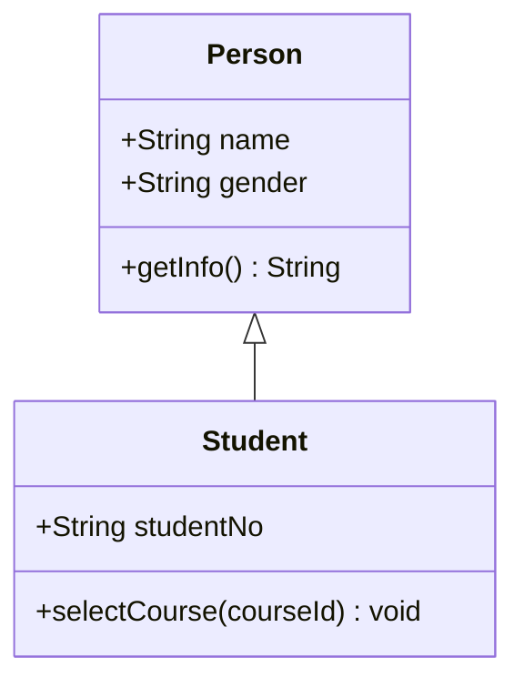

这张图读作：`Student` 继承 `Person`，或者说 `Student` 是 `Person` 的一种。`Student` 可以拥有 `Person` 中定义的通用属性和行为，例如姓名、性别、获取基本信息等；同时，`Student` 又有自己的特有属性和行为，例如学号、选课。

判断是否应该使用继承，可以用一句话测试：**“子类是不是父类的一种？”** 如果答案自然成立，就可能是继承。例如“学生是人”成立；但“学生有课程”不应该画成继承，因为课程不是学生的父类，而是学生关联的对象。

继承关系常见误用是为了复用字段而继承。比如 `Book` 和 `Student` 都有 `name` 字段，不能因此抽象出一个父类叫 `NameObject`。继承表达的是类型层次，不是简单的字段复用。如果只是多个类有相同字段，更可能通过组合、接口、工具类或基类设计来解决，但类图分析阶段不要为了“省字段”强行继承。

# 实现

实现关系表示一个类实现了某个接口，或者说某个具体类承诺提供接口中定义的能力。它强调的不是“是什么”，而是“能做什么”。例如蜂鸟可以飞、飞机可以飞、无人机也可以飞，它们不一定属于同一个父类，但都可以实现 `Flyable` 这个接口。

在 UML 类图中，实现关系使用 **虚线 + 空心三角箭头** 表示，空心三角箭头指向接口。箭头指向接口的原因是：接口比实现类更抽象，实现类遵守接口规定的行为契约。

Mermaid 中可以这样写：

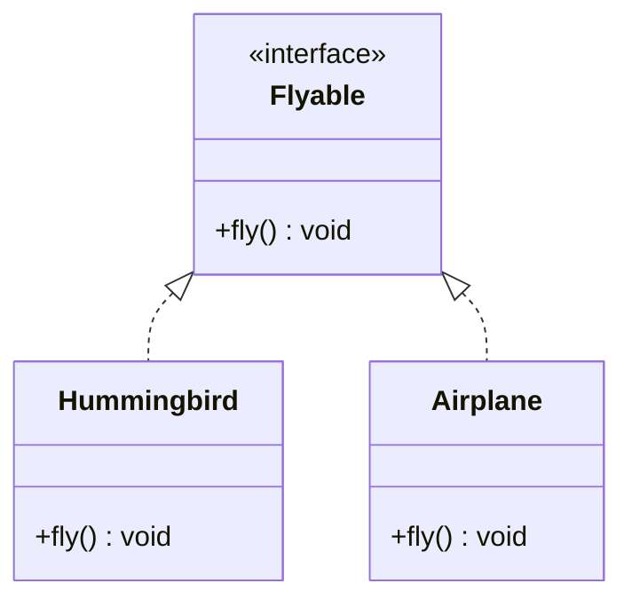

这张图读作：`Hummingbird` 实现了 `Flyable` 接口，`Airplane` 也实现了 `Flyable` 接口。`Flyable` 不关心对象到底是鸟还是飞机，只关心它是否具备 `fly()` 这个能力。

实现关系和继承关系很像，因为它们都有空心三角箭头，区别在于：继承是 **实线 + 空心三角**，实现是 **虚线 + 空心三角**。继承强调“子类是父类的一种”，实现强调“类满足某个接口规范”。

在实际设计中，实现关系经常用于降低耦合。比如订单系统不直接依赖 `EmailNotificationService`，而是依赖 `NotificationService` 接口。这样以后把通知方式从邮件换成短信、站内信、企业微信，调用方不需要大改。

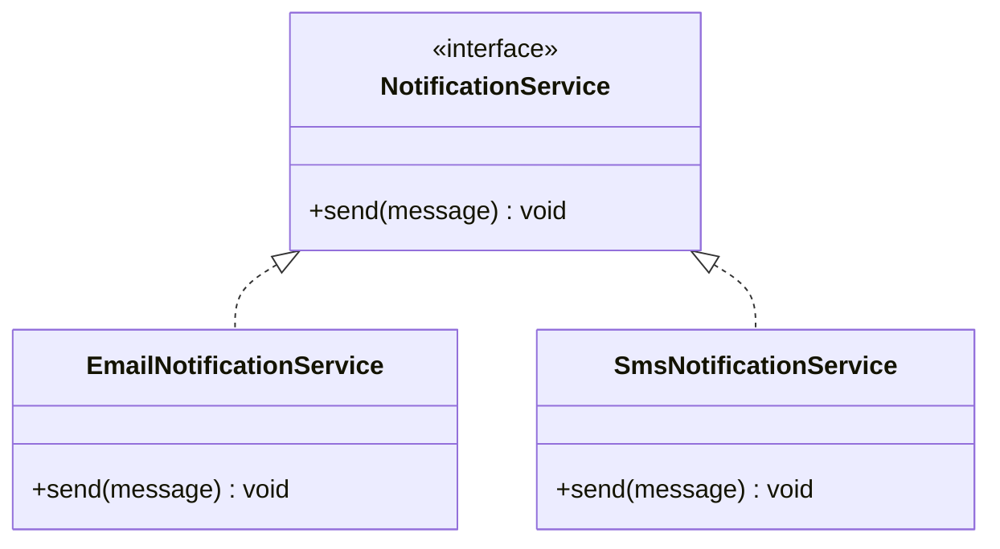

# 依赖

依赖关系表示一个类在某个局部范围内使用了另一个类。它通常出现在方法参数、方法返回值、局部变量、静态方法调用、临时对象创建等场景中。依赖关系的特点是：**使用关系比较短暂，通常不是长期持有**。

在 UML 类图中，依赖使用 **虚线箭头** 表示，箭头指向被依赖的类。也就是说，`A ..> B` 表示 A 依赖 B，A 使用了 B。如果 B 的接口发生变化，A 可能会受到影响。

例如，一个工厂类负责创建产品对象：

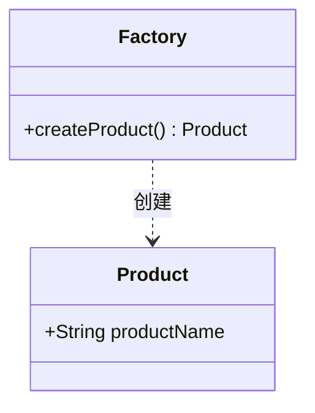

这张图读作：`Factory` 依赖 `Product`。因为 `Factory` 的 `createProduct()` 方法返回了 `Product`，说明工厂类在创建产品时使用到了产品类。

依赖也可以出现在方法参数中。例如 `ReportPrinter` 打印报表时需要临时使用 `Report`：

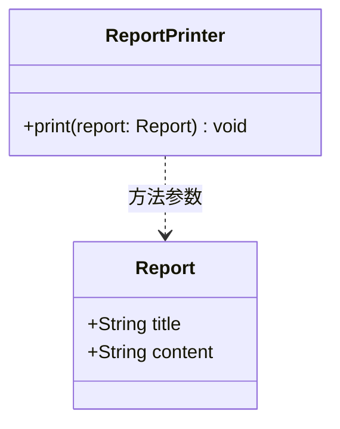

这表示 `ReportPrinter` 不是长期拥有一个 `Report`，而是在打印方法执行时使用传入的 `Report`。因此它更适合画成依赖，而不是关联。

依赖是六种关系中比较弱的一种。建模时不要把所有方法参数都画成依赖，否则类图会非常杂乱。只有当某个依赖对理解设计有帮助时才画。例如“预约服务依赖通知接口”就值得画，因为它说明了业务服务和外部通知能力之间的调用关系。

# 关联

关联关系表示两个类的对象之间存在比较稳定的结构联系。相比依赖，关联更持久，通常可以理解为一个类知道另一个类，或者一个类中把另一个类作为成员变量保存。

在 UML 类图中，关联使用 **实线** 表示。如果需要说明导航方向，可以加箭头。没有箭头的实线通常表示双向关联或暂不强调方向；带箭头的实线表示可以从一个对象导航到另一个对象。

例如，一个学生可以拥有多条预约记录：

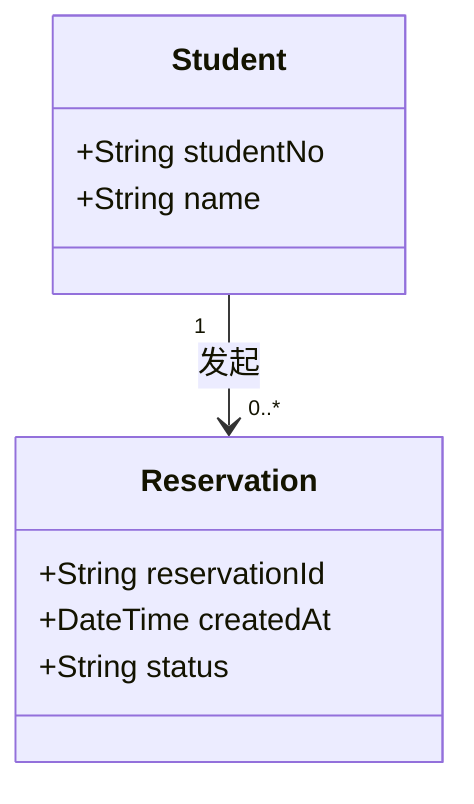

这张图读作：一个 `Student` 可以发起 0 到多条 `Reservation`；一条 `Reservation` 只属于 1 个 `Student`。这里的 `1` 和 `0..*` 是多重性，用来说明对象数量约束。

多重性是关联关系中非常重要的部分。常见写法如下：

| 多重性 | 含义 |
| --- | --- |
| `1` | 必须且只能有一个 |
| `0..1` | 可以没有，也可以有一个 |
| `*` 或 `0..*` | 零个到多个 |
| `1..*` | 至少一个 |
| `m..n` | m 到 n 个 |

读多重性时要注意：**靠近哪个类，就表示对面一个对象可以关联多少个这个类的对象**。例如 `Student "1" --> "0..*" Reservation` 中，靠近 `Reservation` 的 `0..*` 表示一个学生可以有多条预约记录；靠近 `Student` 的 `1` 表示每条预约记录对应一个学生。

关联和依赖的区别可以这样理解：如果只是方法中临时用一下，多半是依赖；如果对象之间有长期结构关系，甚至可能作为成员变量保存，多半是关联。例如 `Student` 长期拥有 `Reservation` 列表，这是关联；`ReservationService` 方法中调用 `NotificationService` 发送通知，这更像依赖。

# 聚合

聚合是一种特殊的关联关系，用来表示 **弱整体-部分**。它说明一个整体对象由若干部分对象组成，但这些部分对象可以脱离整体而独立存在。

在 UML 类图中，聚合使用 **空心菱形 + 实线** 表示，空心菱形放在整体一端。Mermaid 中使用 `o--` 表示，菱形会出现在左侧类的一端。

例如，图书馆和书架可以建模为聚合关系：

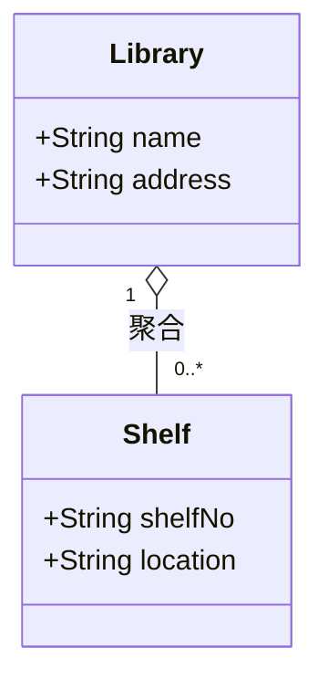

这张图读作：一个 `Library` 可以聚合多个 `Shelf`。书架属于图书馆的一部分，但它并不是完全依赖图书馆生命周期而存在。图书馆调整空间时，书架可以移动、转移，甚至重新归属到另一个馆区。从语义上说，书架有一定独立性，所以可以使用聚合。

再比如，一个班级和学生也常被举为聚合例子：

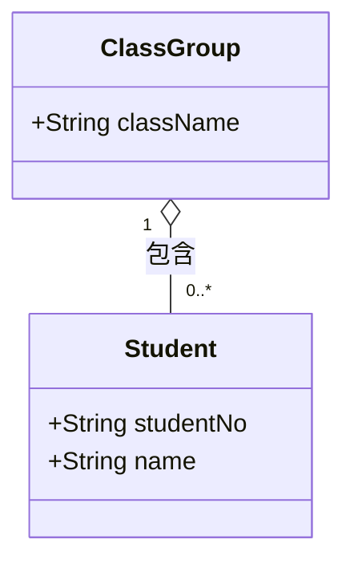

这里表示一个班级包含多个学生，但学生并不会因为班级解散而失去存在意义。学生可以转班、毕业、重新分组，因此学生和班级之间更像弱整体-部分关系。

聚合在实际建模中要谨慎使用。很多时候，普通关联已经足够表达对象之间的联系。如果你无法明确说明“整体-部分”关系，或者无法说明“部分可以独立存在”，那就不要强行使用聚合。

# 组合

组合也是一种特殊的关联关系，用来表示 **强整体-部分**。它比聚合更强，强调部分对象的生命周期强依附于整体对象。整体不存在时，部分通常也没有独立业务意义。

在 UML 类图中，组合使用 **实心菱形 + 实线** 表示，实心菱形放在整体一端。Mermaid 中使用 `*--` 表示，菱形会出现在左侧类的一端。

经典例子是订单和订单明细：

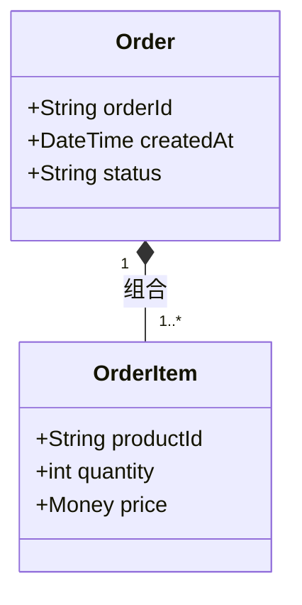

这张图读作：一个 `Order` 由一条或多条 `OrderItem` 组成；每条 `OrderItem` 必须属于一个 `Order`。订单明细通常不能脱离订单单独存在，它的业务意义依附于订单。因此这里使用组合关系。

在图书馆系统中，书目和馆藏副本也可以根据业务语义建模为组合：

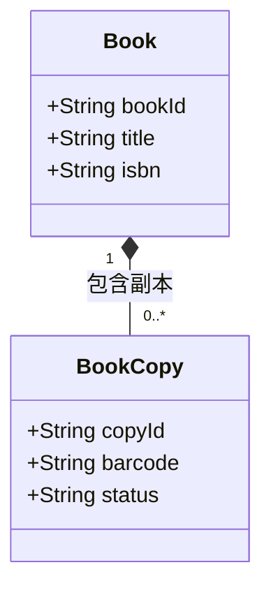

这里的 `Book` 表示书目记录，例如《软件工程导论》这本书的基本信息；`BookCopy` 表示馆藏副本，例如馆内具体某一本贴了条码的书。一个副本必须归属于某个书目记录。离开这个书目记录，副本在系统中就失去了明确的业务归属，因此可以建模为组合。

不过要注意，组合不是数据库“级联删除”的同义词。组合表达的是领域模型中的生命周期语义；数据库实现中是否真的删除子记录，还要考虑审计、历史记录、软删除等策略。也就是说，UML 组合关系强调“业务上强依附”，不等于实现上一定 `ON DELETE CASCADE`。

# 聚合和组合的区别

聚合和组合都表示整体-部分关系，因此最容易混淆。它们的核心区别在于：**部分对象能不能脱离整体而独立存在，以及生命周期是否强绑定**。

| 判断问题 | 聚合 | 组合 |
| --- | --- | --- |
| 菱形样式 | 空心菱形 | 实心菱形 |
| 生命周期绑定 | 弱绑定 | 强绑定 |
| 部分是否能独立存在 | 通常可以 | 通常不可以 |
| 整体消失后部分是否还有业务意义 | 可能仍有 | 通常没有 |
| 示例 | 班级与学生、图书馆与书架 | 订单与订单明细、书目与馆藏副本 |

可以用一个简单问题辅助判断：

> 如果整体对象不存在了，部分对象是否还能以原来的身份独立存在？

如果可以，更偏向聚合；如果不可以，更偏向组合。

例如“班级解散后，学生仍然是学生”，所以班级和学生更像聚合；“订单不存在后，订单明细通常没有独立业务意义”，所以订单和订单明细更像组合。

# 六种关系的综合示例

下面用一个“校园图书馆预约借书系统”的类图，把六种关系放在同一张图中理解：

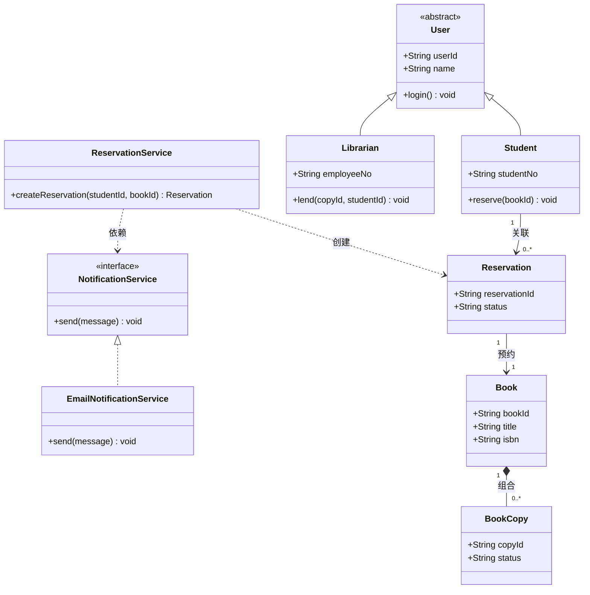

这张图可以这样读：

`Student` 和 `Librarian` 都是 `User` 的特殊类型，因此使用泛化关系。`EmailNotificationService` 实现了 `NotificationService` 接口，因此使用实现关系。`Book` 和 `BookCopy` 是强整体-部分关系，因此使用组合。`Student` 和 `Reservation` 之间存在稳定业务联系，因此使用关联。`ReservationService` 在创建预约时会使用 `Reservation`，并调用 `NotificationService` 发送消息，因此这里画成依赖。

这个例子也说明了一个重要原则：类图不是把所有代码类机械搬上去，而是选择那些对理解业务结构和设计依赖有帮助的类与关系。

# 建模时的判断顺序

当你不知道两个类之间应该画什么关系时，可以按下面的顺序判断：

1. 如果 B 是 A 的一种，使用泛化：`A <|-- B`。
2. 如果 B 实现 A 规定的能力，使用实现：`A <|.. B`。
3. 如果 A 只是临时使用 B，使用依赖：`A ..> B`。
4. 如果 A 长期知道或持有 B，使用关联：`A --> B`。
5. 如果 A 是整体，B 是部分，且 B 可以独立存在，使用聚合：`A o-- B`。
6. 如果 A 是整体，B 是部分，且 B 生命周期强依附 A，使用组合：`A *-- B`。

实际画图时，不要为了展示“高级关系”而强行使用聚合或组合。普通关联加上清楚的多重性和关系名称，很多时候已经足够表达设计意图。

# 常见错误

- 把 `has-a` 关系画成继承。例如“学生有课程”不能画成 `Course <|-- Student`。
- 把所有方法参数都画成依赖，导致类图过度复杂。
- 把聚合和组合混用，尤其是没有考虑生命周期语义。
- 忽略多重性，导致无法看出“一对一”“一对多”“可选”等业务约束。
- 箭头方向画反。继承和实现的空心三角要指向父类或接口；依赖箭头要指向被使用者；菱形要放在整体一端。
- 在类图中写方法体，例如 `void fly(){}`。类图只写方法签名，不写具体实现。
