# UML 建模复习

> 复习目标：把 UML 图当成“分析与沟通工具”，而不是单纯背符号。复习时可以按 **需求边界 → 业务流程 → 对象结构 → 对象协作 → 状态变化** 的顺序理解。
>
> 参考口径：以 OMG 官方 UML 2.5.1 规范为准。Obsidian 中 Mermaid 可以帮助快速画图，但 Mermaid 的图形语法并不完全等同于严格 UML 符号。因此本笔记会同时说明：**标准 UML 怎么看**，以及 **Mermaid 中如何近似表达**。

## 一、统一需求背景：校园图书馆在线预约借书系统

为了让几类图之间能串起来，下面统一采用一个小型需求背景：

> 学校要建设一个“在线预约借书系统”。学生可以搜索图书、预约可借图书、取消预约、到馆取书并完成借阅；图书管理员负责确认取书、办理借出和归还；系统需要在预约即将过期时提醒学生。如果图书库存不足，学生可以加入预约队列，等待后续通知。

### 需求边界

- 系统名称：校园图书馆在线预约借书系统
- 主要参与者：学生、图书管理员、通知服务
- 核心业务：搜索图书、预约图书、取消预约、办理借出、归还图书、发送提醒
- 关键业务规则：
  - 只有登录学生才能预约图书；
  - 每个预约有有效期，超时未取书则自动失效；
  - 同一本图书可能有多个馆藏副本；
  - 可借副本不足时，学生可以加入预约队列；
  - 管理员办理借出后，预约状态变为“已借出”。

## 二、用例图：先确定系统边界和外部角色

### 1. 用例图解决什么问题

用例图回答的是：**系统对外提供哪些可观察的功能，这些功能由谁触发**。

它适合放在需求分析早期，用来和用户、老师、产品方确认系统边界。用例图不关心类怎么设计，也不关心数据库怎么建表，更不应该画成页面跳转图。

一个用例不是“按钮”，也不是“接口”。用例描述的是参与者为了获得某个业务价值而与系统发生的一组交互。例如“预约图书”是用例，“点击预约按钮”只是这个用例中的一个 UI 操作。

### 2. 用例图符号和线条

| 元素 | 标准 UML 表示 | 含义 | 画图时怎么判断 |
| --- | --- | --- | --- |
| 参与者 Actor | 小人图标或带 stereotype 的矩形 | 位于系统外部，与系统发生交互 | 人、外部系统、硬件设备都可能是参与者 |
| 用例 Use Case | 椭圆 | 系统对外提供的业务功能 | 通常用动宾短语命名，如“预约图书” |
| 系统边界 System Boundary | 矩形框 | 框内是当前系统负责的功能 | 边界外放参与者，边界内放用例 |
| 关联 Association | 实线 | 参与者和用例之间存在交互 | 不表示数据流方向，只说明“参与” |
| 包含 Include | 虚线箭头 + `«include»` | 基础用例必然复用另一个用例 | 箭头从基础用例指向被包含用例 |
| 扩展 Extend | 虚线箭头 + `«extend»` | 某条件下追加的可选行为 | 箭头从扩展用例指向被扩展的基础用例 |
| 泛化 Generalization | 实线 + 空心三角箭头 | 参与者或用例之间的继承/特化 | 三角箭头指向更一般、更抽象的一方 |

### 3. include 和 extend 的方向不要记反

这是用例图里最容易混淆的点。

#### include：基础用例指向被包含用例

如果“预约图书”每次都必须“校验登录状态”，那么：

```text
预约图书  --«include»-->  校验登录状态
```

含义是：执行“预约图书”这个用例时，必然会执行“校验登录状态”。被包含用例通常是公共逻辑，比如登录校验、权限校验、身份验证、选择支付方式等。

#### extend：扩展用例指向基础用例

如果“加入预约队列”只在“库存不足”时才发生，那么严格 UML 中通常表示为：

```text
加入预约队列  --«extend»-->  预约图书
```

含义是：“预约图书”本身是一个完整用例；当满足“库存不足”这个扩展条件时，可以额外插入“加入预约队列”。

> 记忆方式：
>
> - include：主流程主动“包含”公共步骤，所以箭头从主流程指向公共步骤；
> - extend：扩展流程依附于基础流程，所以箭头从扩展流程指向基础流程。

### 4. 示例建模

> Mermaid 没有严格的 UML 用例图语法，下面用 flowchart 近似表达。严格考试图建议按 UML 标准画：参与者用小人，用例用椭圆，系统边界用矩形。

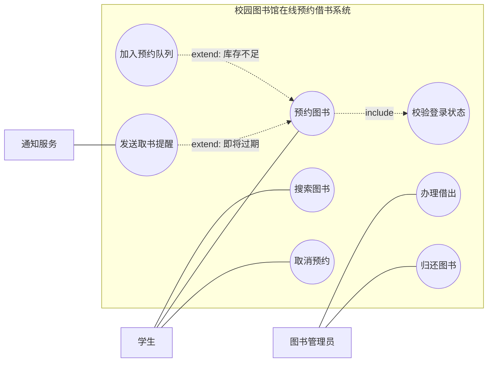

### 5. 读图方法

拿上图来说，读图时不要逐个读箭头，而要先问三个问题：

1. **谁在系统外部？** 学生、图书管理员、通知服务都在系统边界之外。
2. **系统对外承诺了什么能力？** 搜索图书、预约图书、取消预约、办理借出、归还图书、发送取书提醒。
3. **哪些是必做，哪些是条件触发？** 预约图书必须校验登录状态；库存不足时才加入预约队列；预约即将过期时才发送取书提醒。

### 6. 常见错误

- 把“点击按钮”“打开页面”画成用例。用例应是业务目标，而不是 UI 操作。
- 把数据库、实体类画成参与者。参与者必须在系统边界之外。
- 用例粒度过细，导致图里全是 CRUD。课程作业中可以出现“维护图书信息”，但不建议拆成“新增字段”“修改字段”这类技术细节。
- 误用 include / extend：公共必做逻辑用 include，条件触发逻辑用 extend，并注意箭头方向。

## 三、活动图：描述业务流程、条件分支和并发

### 1. 活动图解决什么问题

活动图回答的是：**一个业务过程按什么步骤流转，中间有哪些条件分支、并发和合并**。

它适合描述“预约图书”这种跨多个步骤的业务流程。相比顺序图，活动图更关注控制流；相比状态图，它更关注一次业务过程，而不是某个对象一生中的状态变化。

### 2. 活动图符号和线条

| 元素               | 标准 UML 表示       | 含义              | 复习重点                     |
| ---------------- | --------------- | --------------- | ------------------------ |
| 初始节点             | 实心黑圆            | 流程开始            | 一个活动通常有一个清晰入口            |
| 活动终止节点           | 外圈空心、内圈实心的靶心圆   | 整个活动结束          | 不同分支可以有多个结束点             |
| 动作 Action        | 圆角矩形            | 一个不可再细分或暂不细分的步骤 | 用动词短语，如“查询库存”            |
| 控制流 Control Flow | 实线箭头            | 表示执行顺序          | 从上到下或从左到右保持可读性           |
| 决策节点 Decision    | 菱形，一个入口多个出口     | 根据条件选择分支        | 出口要写条件，如 `[有库存]`、`[无库存]` |
| 合并节点 Merge       | 菱形，多个入口一个出口     | 多个互斥分支重新汇合      | 不等待并发，只合并选择分支            |
| 分叉 Fork          | 粗横线/竖线，一个入口多个出口 | 并发执行多个活动        | 表示这些活动可以同时发生             |
| 汇合 Join          | 粗横线/竖线，多个入口一个出口 | 等待多个并发活动完成      | 和 Merge 不同，它强调同步等待       |
| 泳道 Swimlane      | 按角色分区           | 表示职责归属          | 能看出哪个步骤由谁负责              |
| 对象流 Object Flow  | 箭头连接对象和动作       | 表示对象作为输入/输出流转   | 课程中不一定要求，但能增强分析精度        |

### 3. Decision、Merge、Fork、Join 的区别

这四个符号经常混在一起：

- **Decision**：一个入口、多个出口，表示“走哪条路”。例如库存判断。
- **Merge**：多个入口、一个出口，表示“不同分支又回到同一个后续步骤”。它不等待并发。
- **Fork**：一个入口、多个出口，表示“同时启动多个流程”。例如预约成功后，同时发送通知和设置过期任务。
- **Join**：多个入口、一个出口，表示“等多个并发流程都完成后再继续”。

简单记：菱形处理“选择”，粗线处理“并发”。

### 4. 示例建模：预约图书流程

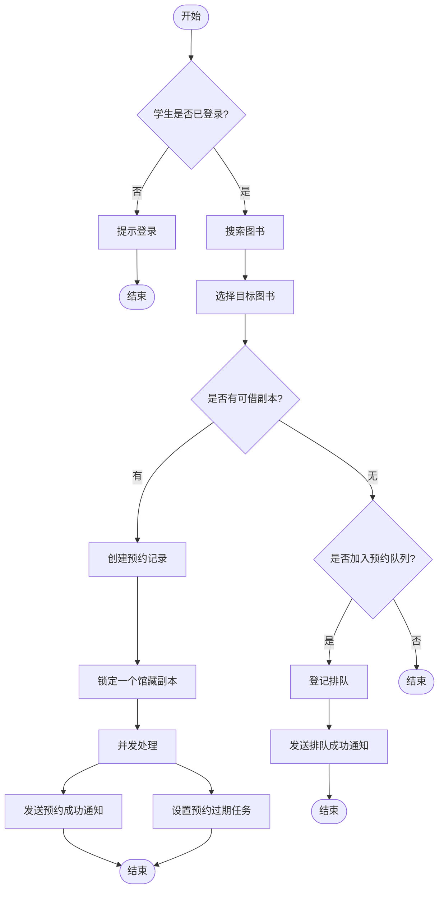

上面的 Mermaid 图用“并发处理”节点近似表示 Fork。严格 UML 活动图里，`发送预约成功通知` 和 `设置预约过期任务` 前应使用一条粗线作为 Fork；如果后面必须等待两个动作都完成，再用 Join 粗线汇合。

### 5. 常见错误

- 活动图只画成“页面 A → 页面 B → 页面 C”，没有业务条件和职责边界。
- 分支条件不清楚，例如只写“是 / 否”，但没有说明判断对象是什么。
- 把对象状态变化全部塞进活动图。若重点是“预约记录从创建到过期的生命周期”，更适合状态图。
- 把 Merge 和 Join 混用：互斥分支汇合用 Merge，并发同步用 Join。

## 四、类图：描述领域对象、属性、操作和关系

### 1. 类图解决什么问题

类图回答的是：**系统中有哪些核心对象，它们有什么属性和行为，对象之间如何关联**。

在分析阶段，类图可以是领域模型，重点表达业务概念；在设计阶段，类图可以进一步靠近代码，表达接口、服务类、仓储类、继承结构和方法签名。复习时要区分：课程里的类图不等于数据库 ER 图，也不等于 Java 代码截图。

类图的关键不只是“画几个类”，而是把类之间的关系说清楚。关系一旦画错，就会误导后续设计：继承画错会导致不合理的代码复用，组合画错会导致生命周期理解错误，多重性漏掉会导致业务约束不清楚。

### 2. 类的基本结构

标准 UML 类通常画成三栏矩形：

```text
+-----------------------------+
| 类名                         |
+-----------------------------+
| 属性                         |
+-----------------------------+
| 操作/方法                    |
+-----------------------------+
```

属性常见写法：

```text
可见性 属性名 : 类型 = 默认值
```

操作常见写法：

```text
可见性 方法名(参数名 : 参数类型) : 返回类型
```

可见性符号：

| 符号 | 含义 | 类比 Java |
| --- | --- | --- |
| `+` | public，公开 | `public` |
| `-` | private，私有 | `private` |
| `#` | protected，受保护 | `protected` |
| `~` | package，包可见 | 默认包访问权限 |

例子：

```text
Reservation
--------------------------------
- reservationId : String
- createdAt : DateTime
- expireAt : DateTime
- status : ReservationStatus
--------------------------------
+ cancel() : void
+ expire() : void
+ completeBorrowing() : void
```

这里 `Reservation` 是预约记录，属性描述它保存什么数据，操作描述它能响应哪些业务行为。分析类图不一定要把所有 getter/setter 写出来，因为它们通常不能帮助理解业务。

### 3. 类图关系总览：线条、箭头和语义

| 关系                | 标准 UML 线条/箭头     | Mermaid 近似写法         | 语义                | 典型例子       |            |
| ----------------- | ---------------- | -------------------- | ----------------- | ---------- | ---------- |
| 关联 Association    | 实线，可选箭头表示可导航方向   | `A -- B` 或 `A --> B` | A 与 B 之间存在结构性联系   | 学生拥有预约记录   |            |
| 依赖 Dependency     | 虚线箭头，箭头指向被使用者    | `A ..> B`            | A 临时使用 B          | 预约服务调用通知服务 |            |
| 泛化 Generalization | 实线 + 空心三角，三角指向父类 | `Parent <            | -- Child`         | 子类 is-a 父类 | 学生是用户      |
| 实现 Realization    | 虚线 + 空心三角，三角指向接口 | `Interface <         | .. Impl`          | 类实现接口      | 邮件通知实现通知服务 |
| 聚合 Aggregation    | 实线 + 空心菱形，菱形在整体端 | `Whole o-- Part`     | 弱整体-部分，部分可独立存在    | 图书馆聚合书架    |            |
| 组合 Composition    | 实线 + 实心菱形，菱形在整体端 | `Whole *-- Part`     | 强整体-部分，部分生命周期依附整体 | 订单组合订单明细   |            |

看类图关系时，先不要背代码，先读语义：

- 是不是 **is-a**？如果是，可能是泛化或实现。
- 是不是 **has-a**？如果是，可能是关联、聚合或组合。
- 是不是 **uses-a**？如果只是临时调用，通常是依赖。
- 整体和部分有没有生命周期绑定？如果绑定很强，才考虑组合。

### 4. 关联 Association：长期结构关系

关联是类图中最常见的关系，表示两个类的对象之间存在较稳定的结构联系。

标准 UML 中，关联用 **实线** 表示：

```text
Student  --------  Reservation
```

如果需要表示可导航方向，可以加箭头：

```text
Student  ------->  Reservation
```

箭头不是“数据流”，而是“从一个对象能否导航到另一个对象”。例如 `Student --> Reservation` 可以理解为：从学生对象可以找到它的预约记录。

Mermaid 示例：

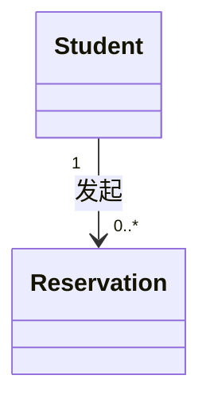

这条关系要这样读：

- 靠近 `Student` 一端的 `1` 表示：每条预约记录属于 1 个学生；
- 靠近 `Reservation` 一端的 `0..*` 表示：一个学生可以有 0 到多条预约记录；
- `发起` 是关系名称，用来说明两者为什么有关联。

> 多重性要“站在对面读”。靠近谁，就约束“对面的一个对象能关联多少个它”。

常见多重性：

| 写法           | 含义            |
| ------------ | ------------- |
| `1`          | 必须且只能有 1 个    |
| `0..1`       | 可以没有，也可以有 1 个 |
| `*` 或 `0..*` | 0 到多个         |
| `1..*`       | 至少 1 个        |
| `m..n`       | m 到 n 个       |

### 5. 依赖 Dependency：临时使用关系

依赖表示一个类在某个方法、参数、局部变量或调用过程中临时使用另一个类。它不是长期持有，不一定作为字段存在。

标准 UML 中，依赖用 **虚线箭头** 表示，箭头指向被依赖者：

```text
ReservationService  - - - ->  NotificationService
```

含义是：`ReservationService` 使用了 `NotificationService`。如果通知服务接口变化，预约服务可能受到影响。

Mermaid 示例：

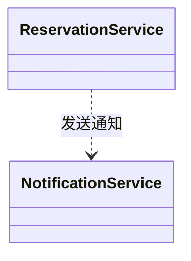

在代码层面，依赖可能表现为：

- 方法参数中使用了某个类型；
- 方法内部创建或调用了某个对象；
- 服务层调用另一个服务；
- 控制器调用应用服务。

不要把所有依赖都画进分析类图。只有当这个依赖对理解设计有帮助时才画，例如“预约服务依赖通知服务”能说明通知逻辑不是预约记录自己完成的。

### 6. 泛化 Generalization：继承关系

泛化表示“子类是父类的一种”，也就是 **is-a** 关系。标准 UML 中，泛化用 **实线 + 空心三角箭头** 表示，三角箭头指向父类。

```text
Student  --------▷  User
```

Mermaid 中常写成：

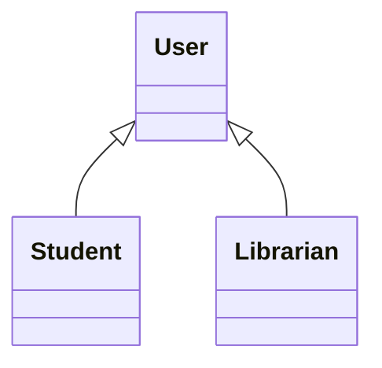

这表示：`Student` 和 `Librarian` 都继承自 `User`。箭头三角指向 `User`，因为 `User` 是更抽象、更一般的概念。

判断是否应该使用继承，可以问：

- 学生是不是用户的一种？是。
- 管理员是不是用户的一种？是。
- 图书是不是预约的一种？不是。
- 学生有没有预约？有，但这是 has-a，不是 is-a。

继承不能只为了“复用字段”而使用。建模时如果只是两个类碰巧都有 `name` 字段，不代表它们就应该继承同一个父类。

### 7. 实现 Realization：类实现接口

实现关系用于表示一个类实现某个接口或抽象规范。标准 UML 中，实现关系用 **虚线 + 空心三角箭头** 表示，三角箭头指向接口。

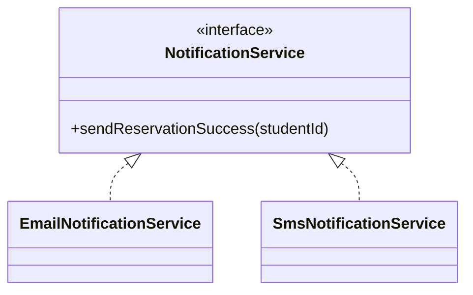

读法是：`EmailNotificationService` 实现 `NotificationService` 接口，`SmsNotificationService` 也实现这个接口。

实现关系强调的是“遵守能力约定”。在设计层面，它可以降低调用方和具体实现之间的耦合。预约服务只依赖 `NotificationService`，而不必关心通知最终是短信、邮件还是站内信。

### 8. 聚合 Aggregation：弱整体-部分关系

聚合表示整体和部分之间的关系，但部分可以脱离整体独立存在。标准 UML 中，聚合用 **空心菱形 + 实线** 表示，空心菱形在整体一端。

```text
Library  ◇------  Shelf
```

Mermaid 示例：

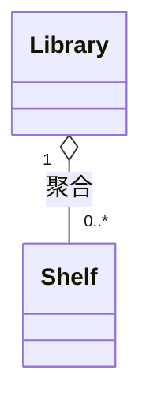

含义是：一个图书馆可以包含多个书架，但书架这个对象不一定因为图书馆对象销毁就必须销毁。在业务上，书架可以移动、调整、重新归属，因此它和图书馆之间是较弱的整体-部分关系。

聚合在实际建模中争议较多。如果无法明确说明“弱整体-部分”的语义，使用普通关联往往更安全。

### 9. 组合 Composition：强整体-部分关系

组合表示更强的整体-部分关系。标准 UML 中，组合用 **实心菱形 + 实线** 表示，实心菱形在整体一端。

```text
Order  ◆------  OrderItem
```

它强调：部分对象的生命周期强依附于整体对象。整体不存在时，部分通常也没有独立业务意义。

在图书馆例子里，可以把 `Book` 和 `BookCopy` 建模为组合：

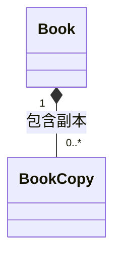

读法是：一本书目记录可以包含多个馆藏副本，一个馆藏副本必须归属于一个书目。这里的 `BookCopy` 不是“另一本书”，而是某个书目下的物理馆藏副本。如果书目记录被删除，副本在这个系统里的业务归属也会消失。

不过要注意，组合不是数据库级联删除的同义词。组合表达的是领域生命周期语义，数据库是否真的级联删除，要看具体实现和数据保留策略。

### 10. 关联、聚合、组合怎么区分

这三个关系都可能表现为 has-a，容易混淆。

| 判断问题 | 普通关联 | 聚合 | 组合 |
| --- | --- | --- | --- |
| 是否是整体-部分？ | 不一定 | 是 | 是 |
| 部分能否脱离整体存在？ | 可以 | 通常可以 | 通常不可以 |
| 生命周期是否强绑定？ | 不强调 | 弱绑定 | 强绑定 |
| 菱形位置 | 无菱形 | 空心菱形在整体端 | 实心菱形在整体端 |
| 使用建议 | 最常用 | 谨慎使用 | 只有生命周期强绑定时使用 |

例子：

- `Student -- Reservation`：普通关联。预约属于学生，但建模重点是业务联系，不一定强调整体-部分。
- `Library o-- Shelf`：聚合。图书馆拥有书架，但书架可以迁移。
- `Book *-- BookCopy`：组合。馆藏副本强依附于书目记录。

如果考试没有特别要求，不确定时优先使用普通关联，再用多重性和关系名说清楚约束。

### 11. 示例建模：领域类图

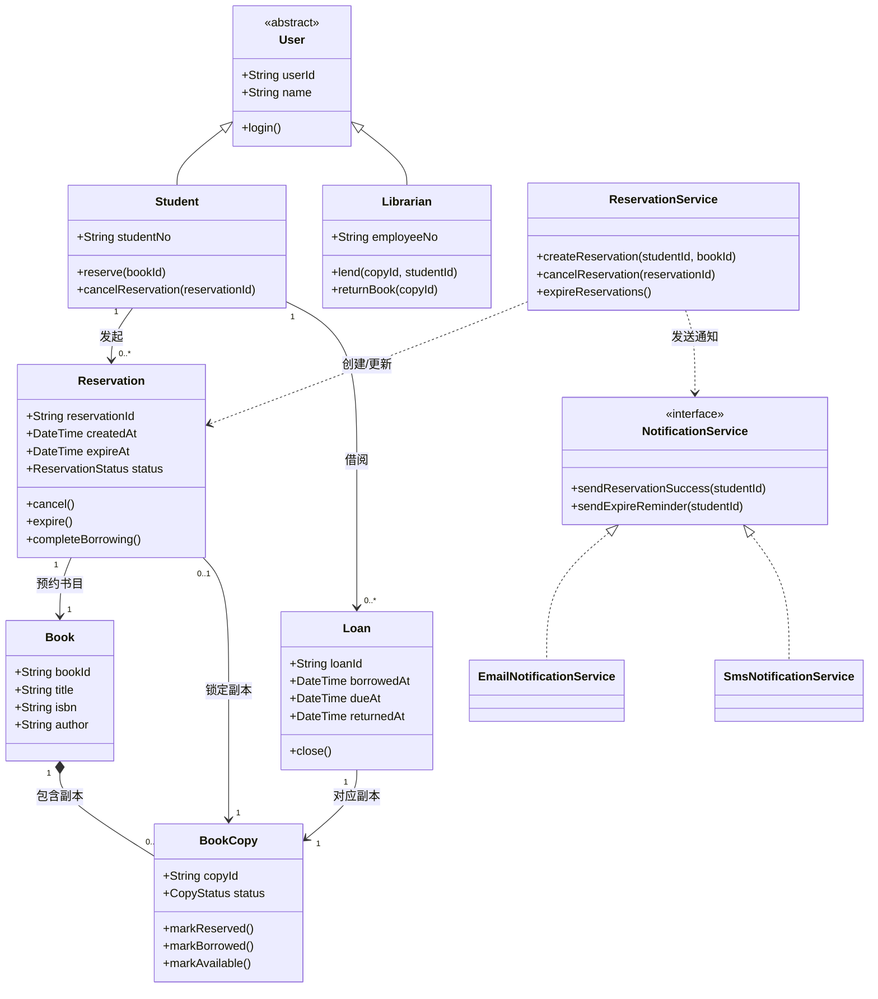

### 12. 类图常见错误

- 把所有类都设计成“Service + DAO”，缺少领域对象，导致类图无法表达业务。
- 多重性漏写。类图的价值之一就是说明“一个学生可以有多个预约记录，一条预约只属于一个学生”。
- 聚合和组合乱用。拿不准时优先用普通关联，避免为了“高级”而使用错误关系。
- 把 has-a 画成继承。例如“学生有预约记录”不能画成 `Student <|-- Reservation`。
- 类图过度贴近数据库，把中间表、字段类型、索引细节全部画进去，反而影响分析重点。
- 类方法写得过细，把 getter/setter 全写上，掩盖了真正的业务行为。

## 五、顺序图：描述对象之间按时间顺序的协作

### 1. 顺序图解决什么问题

顺序图回答的是：**为了完成某个场景，哪些对象按照什么时间顺序发送消息**。

它适合描述一个具体用例的主成功场景或异常场景。例如“学生预约有库存图书”可以画一张顺序图，“库存不足加入队列”可以单独画另一张。不要试图用一张顺序图覆盖所有业务分支，否则图会变得很乱。

### 2. 顺序图符号和线条

| 元素 | 标准 UML 表示 | Mermaid 近似写法 | 含义 |
| --- | --- | --- | --- |
| 生命线 Lifeline | 顶部对象框 + 垂直虚线 | `participant A as 名称` | 参与交互的对象或角色 |
| Actor | 小人 | `actor User as 用户` | 外部参与者 |
| 激活条 Activation | 生命线上的细长矩形 | `activate A` / `deactivate A` | 对象正在执行操作 |
| 同步消息 | 实线 + 实心箭头 | `A->>B: message` | 调用方等待返回 |
| 异步消息 | 实线 + 开放箭头 | Mermaid 可用 `A-)B: message` 近似 | 调用方不等待立即返回 |
| 返回消息 | 虚线 + 开放箭头 | `B-->>A: result` | 返回结果 |
| 自调用 | 回到自身的消息 | `A->>A: validate()` | 对象内部调用自身方法 |
| 创建消息 | 指向新对象生命线开始处 | Mermaid 可用 `create participant` | 创建对象 |
| 销毁消息 | 生命线末端 X | Mermaid 可用 `destroy participant` | 对象生命周期结束 |
| 组合片段 | 带标签的框 | `alt`、`opt`、`loop`、`par` | 表达条件、可选、循环、并发 |

### 3. 常见组合片段

| 片段 | 含义 | 使用场景 |
| --- | --- | --- |
| `alt` | 多选一分支 | 有库存 / 无库存，权限通过 / 权限失败 |
| `opt` | 可选流程 | 如果需要提醒，则发送提醒 |
| `loop` | 循环 | 遍历过期预约记录 |
| `par` | 并发 | 同时发送通知和记录日志 |
| `break` | 中断流程 | 校验失败后直接返回 |

顺序图的重点是“时间顺序”。图中越靠上的消息越早发生，越靠下的消息越晚发生。生命线从左到右通常按调用链或职责边界排列，例如：用户 → 前端 → 应用服务 → 领域服务/仓储 → 外部服务。

### 4. 示例建模：学生预约有库存图书

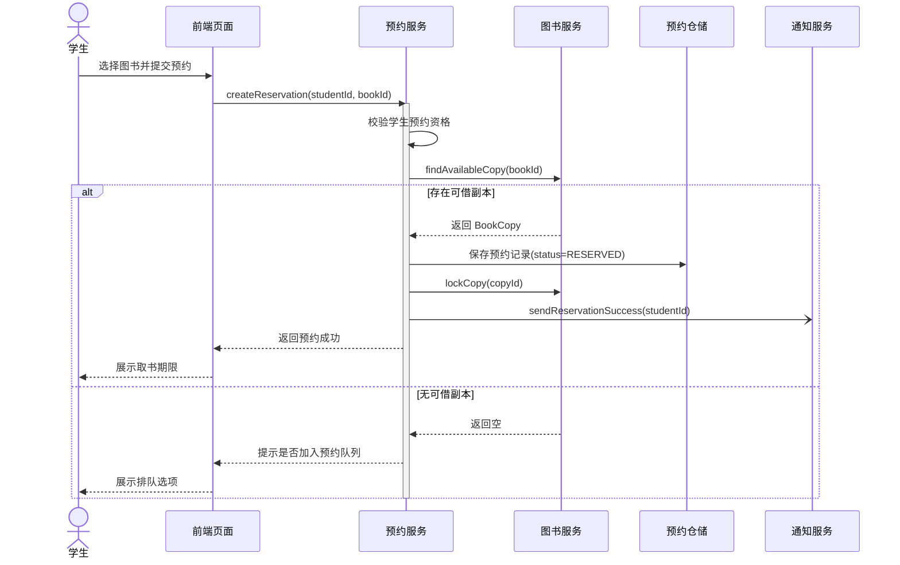

### 5. 逐步解释顺序图

- 学生不是系统内部对象，所以用 `actor` 表示。
- 前端页面接收用户操作，但真正的业务规则不应全部放在前端，因此它调用 `预约服务`。
- `预约服务` 是主控对象，负责校验资格、查询可借副本、保存预约记录、调用通知服务。
- `findAvailableCopy(bookId)` 是同步调用，因为预约服务需要等待图书服务返回是否有可借副本。
- `sendReservationSuccess(studentId)` 可以设计为异步消息，因为通知成功与否通常不应阻塞预约主流程。这里是示例假设，具体项目要看业务要求。
- `alt` 片段表达两条互斥分支：有库存和无库存。

### 6. 常见错误

- 顺序图画成“用户 → 系统”两条生命线，缺少对象协作，无法体现设计。
- 把类图中的所有类都搬进顺序图。顺序图只需要当前场景涉及的对象。
- 忽略异常分支。考试和设计评审中，`alt` 片段经常用来表达库存不足、权限失败、库存锁定失败等场景。
- 返回消息写得过多。简单返回可省略，关键业务结果要保留。
- 把顺序图画成流程图。顺序图强调对象之间发消息，而不是只描述业务步骤。

## 六、状态图：描述一个对象的生命周期

### 1. 状态图解决什么问题

状态图回答的是：**某个对象在生命周期中有哪些稳定状态，什么事件会触发状态迁移**。

它适合状态比较明显的对象，例如预约记录、订单、借阅记录、审批单。状态图不适合描述多个对象之间的调用顺序；那是顺序图的职责。

### 2. 状态图符号和线条

| 元素 | 标准 UML 表示 | 含义 | 复习重点 |
| --- | --- | --- | --- |
| 初始状态 | 实心黑圆 | 对象生命周期开始 | 通常只有一个入口 |
| 终止状态 | 靶心圆 | 对象生命周期结束 | 表示对象不再继续迁移 |
| 状态 State | 圆角矩形 | 对象在某阶段的稳定条件 | 状态名通常是“已预约”“已取消” |
| 转移 Transition | 实线箭头 | 从一个状态迁移到另一个状态 | 箭头上写触发事件 |
| 事件 Event | 写在箭头标签中 | 触发状态变化的事情 | 如“学生取消”“预约超时” |
| 监护条件 Guard | `[条件]` | 条件满足时才允许转移 | 如 `[未超过取书期限]` |
| 动作 Action | `/动作` | 转移发生时执行的动作 | 如 `/释放副本库存` |
| entry / exit / do | 状态内部行为 | 进入、退出、持续执行 | 用于复杂状态 |

转移标签常见格式：

```text
事件 [监护条件] / 动作
```

例如：

```text
预约超时 [未取书] / 释放副本库存
```

含义是：当预约超时事件发生，并且用户还没有取书时，系统释放副本库存，并把预约迁移到过期状态。

### 3. 示例建模：预约记录状态图

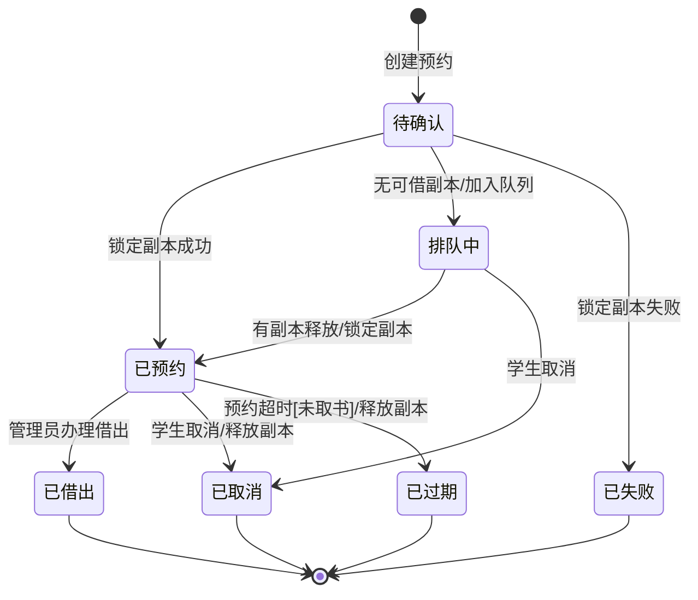

### 4. 状态和动作的区别

状态图里最容易犯的错误，是把动作误当成状态。

- “已预约”是状态，因为对象可以稳定停留在这个阶段。
- “排队中”是状态，因为对象会等待副本释放。
- “发送通知”不是状态，而是动作。
- “点击预约按钮”不是状态，而是事件或用户动作。
- “释放库存”不是状态，而是迁移过程中执行的动作。

判断标准是：对象能不能在这个词描述的阶段停留一段时间？如果能，通常是状态；如果只是瞬间执行，通常是动作或事件。

### 5. 常见错误

- 把活动步骤当状态，例如“点击预约按钮”“发送短信”不是稳定状态。
- 状态没有终止路径，导致生命周期不完整。
- 转移只写箭头不写触发事件，无法解释为什么状态会变化。
- 一个状态图描述多个对象，结果边界混乱。通常一张状态图只围绕一个核心对象。
- 状态命名使用动词，导致状态和动作混淆。状态更适合用名词或形容词短语。

## 七、五类图之间如何配合

可以按下面的顺序把几类图串起来复习：

1. **用例图**：确定系统边界、参与者、系统对外提供的功能。
2. **活动图**：挑一个用例，描述业务流程、分支、并发和职责边界。
3. **类图**：从业务名词中提炼领域对象，补充属性、操作和关系。
4. **顺序图**：挑一个具体场景，说明对象之间如何协作完成流程。
5. **状态图**：挑一个有生命周期的核心对象，说明它的状态和转移规则。

对“校园图书馆在线预约借书系统”来说，可以这样对应：

| 图 | 本例关注点 | 产出 |
| --- | --- | --- |
| 用例图 | 学生、管理员、通知服务分别能做什么 | 系统功能边界 |
| 活动图 | 学生预约图书的完整流程 | 业务控制流 |
| 类图 | 学生、图书、馆藏副本、预约、借阅等对象关系 | 领域结构 |
| 顺序图 | 学生提交预约后，前端、服务、仓储、通知如何交互 | 对象协作 |
| 状态图 | 预约记录如何从创建走向已预约、排队、取消、过期、已借出 | 生命周期规则 |

### 从一个需求句子推导多张图

需求句子：

> 学生登录后可以预约图书；如果有可借副本，系统锁定副本并通知学生；如果没有可借副本，学生可以加入预约队列；预约超时未取书时系统释放副本。

可以这样拆：

- “学生”是用例图参与者，也是类图中的 `Student`。
- “预约图书”是用例图中的用例，也是活动图中的主流程。
- “有可借副本 / 没有可借副本”是活动图中的决策分支，也是顺序图中的 `alt` 片段。
- “图书”“馆藏副本”“预约记录”是类图中的核心领域类。
- “预约超时未取书”是状态图中的事件和条件。
- “释放副本”是状态迁移时执行的动作。

## 八、复习时的建模方法

### 1. 从文本需求中找模型元素

- 名词通常候选为类：学生、图书、馆藏副本、预约记录、借阅记录。
- 动词通常候选为用例或操作：搜索、预约、取消、借出、归还、提醒。
- 条件通常候选为活动图分支或状态转移条件：库存不足、超时未取、锁定失败。
- 角色通常候选为参与者或泳道：学生、管理员、通知服务。

### 2. 控制图的粒度

一张图只解决一个主要问题：

- 用例图不要塞业务步骤；
- 活动图不要塞过多类和方法；
- 类图不要替代数据库设计；
- 顺序图不要覆盖所有用例；
- 状态图不要描述多个对象的完整业务流程。

### 3. 符号速查表

| 图 | 实线通常表示 | 虚线通常表示 | 空心三角 | 菱形 | 重点 |
| --- | --- | --- | --- | --- | --- |
| 用例图 | 参与者和用例的关联 | include / extend 依赖 | 泛化 | 不常用 | 系统边界和功能 |
| 类图 | 关联、继承、聚合、组合 | 依赖、实现 | 指向父类或接口 | 空心聚合、实心组合 | 对象结构和关系 |
| 顺序图 | 同步/异步消息 | 返回消息 | 不常用 | 不常用 | 时间顺序和消息调用 |
| 活动图 | 控制流 | 不常用 | 不常用 | 决策/合并节点 | 流程、分支、并发 |
| 状态图 | 状态转移 | 不常用 | 不常用 | 不常用 | 状态、事件、迁移 |

### 4. 检查清单

建模完成后可以用下面的问题自查：

- 用例图：系统边界清楚吗？参与者都在边界外吗？用例名称是否体现业务目标？include / extend 的方向是否正确？
- 活动图：是否覆盖主流程和关键异常分支？判断条件是否明确？并发和分支有没有混用？
- 类图：核心类是否来自业务概念？多重性是否标注？继承、依赖、关联、聚合、组合是否能说出理由？
- 顺序图：生命线是否只保留当前场景相关对象？消息顺序是否能跑通？是否需要 `alt` 表达分支？
- 状态图：状态是否稳定？转移是否有事件？是否有终止状态？动作和状态有没有混淆？

## 九、参考资料

- [OMG Unified Modeling Language Specification Version 2.5.1](https://www.omg.org/spec/UML)
- [OMG: What is UML?](https://www.omg.org/uml/what-is-uml.htm)

